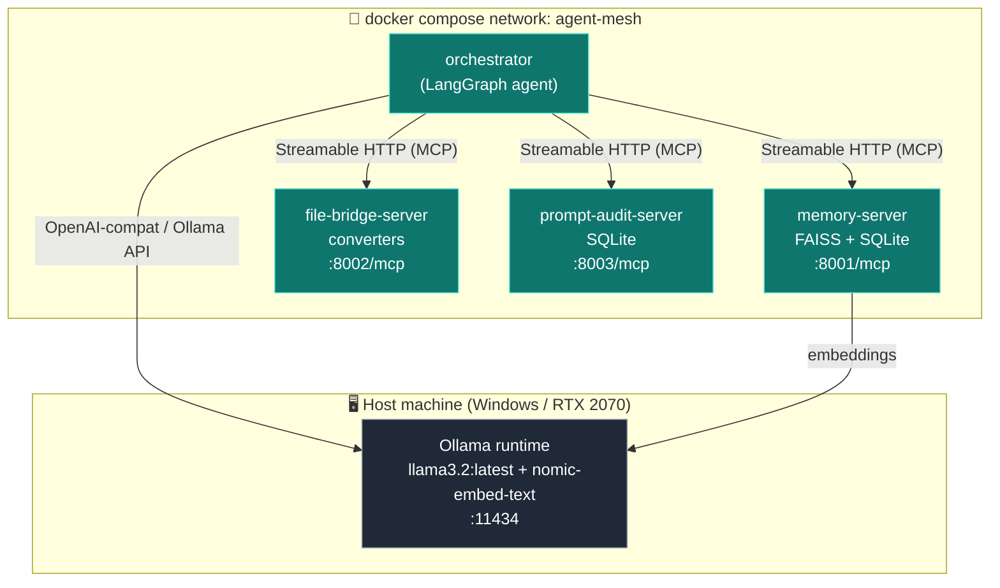
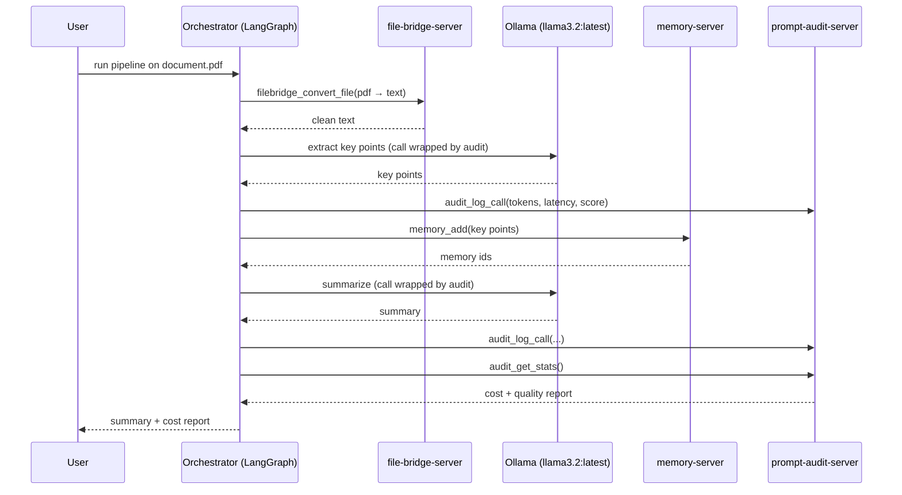

# 🕸️ agent-mesh

> A public toolkit of production-ready **MCP (Model Context Protocol) servers** plus a **LangGraph orchestrator** that wires them together into a single, runnable document-processing pipeline.

`agent-mesh` is three small, focused MCP servers — **memory**, **file conversion**, and **prompt/LLM auditing** — and one demo agent that uses all three over a common protocol. It runs locally on a laptop GPU against an Ollama model (`llama3.2:latest`), and the whole mesh comes up with a single command.

The name says the intent: a *mesh* of independent agents/services that talk to each other through one shared protocol. That is exactly what MCP enables.

---

## Why this exists

Most "agent" demos are a single script with hard-wired functions. `agent-mesh` is the opposite: each capability is an **independent, reusable server** that any MCP-compatible client (Claude Desktop, Cursor, an IDE, or this repo's own LangGraph agent) can discover and call. The orchestrator is just *one* consumer of these servers — you could point a completely different client at the same mesh.

It is built to demonstrate three engineering concerns that matter in real LLM systems:

1. **Persistent memory** — vector storage you can write to, search, and prune (`memory-server`).
2. **Reliable I/O** — turning messy file formats into clean text the model can actually use (`file-bridge-server`).
3. **Governance** — every LLM call is logged with token counts, latency, and a quality score, then summarized into a cost report (`prompt-audit-server`).

> **On intellectual property:** `agent-mesh` is a clean-room showcase. It reimplements *generic* versions of ideas explored in private projects (a knowledge/memory layer; a file-conversion tool) using only public libraries and original code. No proprietary source, data, prompts, or model weights are included or required. See [NOTICE](#license--ip) below.

---

## Architecture at a glance



The three servers run as separate containers and expose MCP over **Streamable HTTP**. The orchestrator connects to all three through a single `MultiServerMCPClient` and uses the local Ollama model for the actual reasoning. Ollama stays on the **host** so the GPU is used natively — containers reach it via `host.docker.internal`.

For the full rationale (transport choice, deterministic vs. autonomous orchestration, failure modes), see [`docs/ARCHITECTURE.md`](docs/ARCHITECTURE.md).

---

## The three servers

| Server | Tools | Backend | Purpose |
|---|---|---|---|
| **`memory-server`** | `memory_add`, `memory_search`, `memory_list`, `memory_delete` | FAISS (vectors) + SQLite (text/metadata) | Persistent, searchable vector memory |
| **`file-bridge-server`** | `filebridge_convert_file`, `filebridge_list_formats`, `filebridge_preview_output` | Pluggable converters (markdown-native / PyMuPDF / pandoc) | Normalize documents to clean text |
| **`prompt-audit-server`** | `audit_log_call`, `audit_get_stats`, `audit_flag_anomaly` | SQLite | Log + analyze every LLM call; produce cost reports |

Full input/output schemas, annotations, and error contracts for every tool live in [`docs/SERVER_SPECS.md`](docs/SERVER_SPECS.md).

---

## The demo: end-to-end document pipeline

The LangGraph orchestrator runs a deterministic pipeline that exercises all three servers:



Run it in one command (see [Quickstart](#quickstart)):

```bash
docker compose up
```

---

## Quickstart

> **Prerequisites:** Docker Desktop (WSL2 backend on Windows), [Ollama](https://ollama.com) installed on the host, and ~6 GB free VRAM. Full, OS-specific setup is in [`docs/SETUP.md`](docs/SETUP.md).

**1. Pull the models on the host (one time):**

```bash
ollama pull llama3.2:latest      # ~2.0 GB — the reasoning model
ollama pull nomic-embed-text     # ~275 MB — embeddings for memory-server
```

**2. Make sure Ollama is listening for containers.** On Windows, set the environment variable `OLLAMA_HOST=0.0.0.0:11434` and restart Ollama so the compose network can reach it. (Your custom model path `D:\.ollama\models` is set via `OLLAMA_MODELS` — see SETUP.)

**3. Configure and launch:**

```bash
cp .env.example .env            # adjust if needed
docker compose up --build
```

**4. Run the demo against the bundled sample, or your own file:**

```bash
# uses examples/sample.md by default
docker compose run --rm orchestrator python -m agent.orchestrator --input examples/sample.md
```

You'll get a summary plus a cost/quality report like:

```
=== agent-mesh pipeline complete ===
Document: examples/sample.md  →  1,240 tokens in / 320 tokens out
Memory:   4 key points stored (ids 17–20)
LLM calls: 2  |  total latency: 3.8 s  |  avg quality: 0.91
Notional cloud cost (GPT-4-class @ $X/1M): $0.0094   |   Local cost: $0.00
```

### Dev mode (no Docker)

Each server also runs over **stdio** for local iteration with the MCP Inspector or Claude Desktop — no containers required. See [`docs/SETUP.md`](docs/SETUP.md#dev-mode-stdio) and [`docs/IMPLEMENTATION_PLAN.md`](docs/IMPLEMENTATION_PLAN.md).

---

## Repository layout

```
agent-mesh/
├── README.md
├── requirements.txt
├── .env.example                  # configuration template
├── docker-compose.yml            # spins up 3 servers + orchestrator
├── start-servers.ps1             # start all three MCP servers (local dev)
├── start-servers.bat             # .bat wrapper for PowerShell-policy-free double-click
├── stop-servers.ps1              # stop all three MCP servers
├── stop-servers.bat
├── common/                       # shared helpers
│   ├── config.py                 # Pydantic Settings; single source of truth
│   ├── logging_setup.py          # per-run timestamped log files in logs/
│   ├── responses.py              # JSON/Markdown response formatting
│   └── errors.py
├── servers/
│   ├── memory_server.py
│   ├── file_bridge_server.py
│   ├── prompt_audit_server.py
│   └── converters/               # pluggable converter registry
│       ├── markdown_converter.py # pure-Python markdown->text (no pandoc needed)
│       ├── pandoc_converter.py   # docx/html/rst via pandoc binary
│       ├── pdf_converter.py      # PDF via PyMuPDF
│       └── passthrough_converter.py
├── agent/
│   ├── orchestrator.py           # LangGraph pipeline + ReAct variant
│   ├── audited.py                # LLM call wrapper (timing, quality, audit log)
│   ├── clients.py                # MCP client + ChatOllama factory
│   └── quality.py                # deterministic 4-signal quality scorer
├── examples/
│   └── sample.md                 # demo input
├── tests/                        # unit + integration + e2e
├── logs/                         # per-run log files (gitignored)
├── evals/                        # MCP-style evaluation suites (per server)
└── docs/
    ├── design/
    │   ├── ARCHITECTURE.md
    │   ├── SERVER_SPECS.md
    │   └── TECH_STACK.md
    └── operations/
        ├── SETUP.md
        └── TESTING_AND_EVALUATION.md
```

---

## Documentation map

| Document | What's in it |
|---|---|
| [`docs/design/ARCHITECTURE.md`](docs/design/ARCHITECTURE.md) | System topology, transport rationale, data flow, deployment, failure modes, security |
| [`docs/design/TECH_STACK.md`](docs/design/TECH_STACK.md) | Every technology, version, why it was chosen, alternatives considered |
| [`docs/design/SERVER_SPECS.md`](docs/design/SERVER_SPECS.md) | Per-tool input/output schemas, annotations, errors, examples |
| [`docs/operations/SETUP.md`](docs/operations/SETUP.md) | OS-specific setup (Windows + Ollama + Docker + local scripts), troubleshooting |
| [`docs/operations/TESTING_AND_EVALUATION.md`](docs/operations/TESTING_AND_EVALUATION.md) | Test pyramid, MCP Inspector, evaluation harness |

---

## Tech stack (short version)

- **Servers:** Python 3.12 · [MCP Python SDK](https://github.com/modelcontextprotocol/python-sdk) (`FastMCP`) · Pydantic v2 · Streamable HTTP transport
- **Memory:** FAISS (`faiss-cpu`) + SQLite · embeddings via Ollama `nomic-embed-text`
- **Orchestrator:** LangGraph · `langchain-ollama` (`ChatOllama`) · `langchain-mcp-adapters` (`MultiServerMCPClient`)
- **Model:** `llama3.2:latest` on Ollama (~2 GB, runs comfortably on 8 GB VRAM)
- **Converters:** markdown-native (no pandoc needed for `.md`), PyMuPDF (PDF), pandoc (docx/html/rst)
- **Logging:** per-run timestamped log files in `logs/` via `common/logging_setup.py`
- **Packaging:** Docker Compose (full mesh) or `start-servers.ps1` (local dev)

Full details and version pins in [`docs/design/TECH_STACK.md`](docs/design/TECH_STACK.md) and [`requirements.txt`](requirements.txt).

---

## Status & roadmap

This repo is in active build-out. See [`docs/MILESTONES.md`](docs/MILESTONES.md) for the full plan.

- [ ] **M0** Project scaffold + shared helpers
- [ ] **M1** `memory-server` (FAISS + SQLite)
- [ ] **M2** `file-bridge-server` (reference converters)
- [ ] **M3** `prompt-audit-server` (SQLite + stats)
- [ ] **M4** LangGraph orchestrator (deterministic pipeline)
- [ ] **M5** Docker Compose mesh + one-command demo
- [ ] **M6** Tests, evaluation suites, polish

---

## License & IP

Released under the **MIT License** (see `LICENSE`).

**NOTICE.** `agent-mesh` contains only original code and public dependencies. It is inspired by, but shares no source code, data, prompts, schemas, or model weights with, any private project. The `file-bridge-server` ships a generic reference converter; private conversion logic can be added behind the documented `Converter` interface without modifying the public repo. The `memory-server` is a generic vector-memory implementation. Nothing here exposes proprietary intellectual property.
