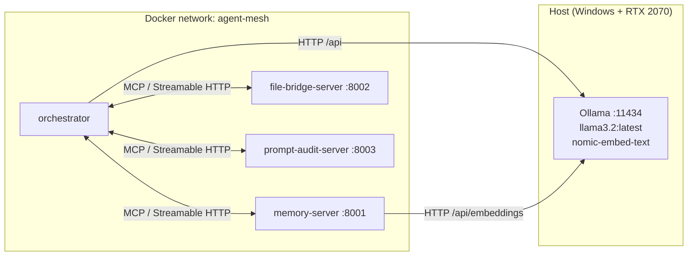
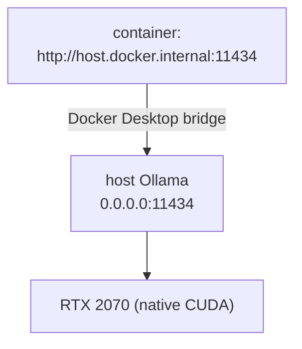
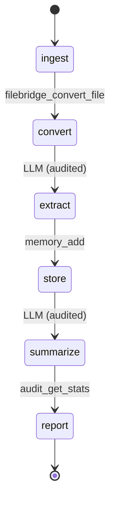
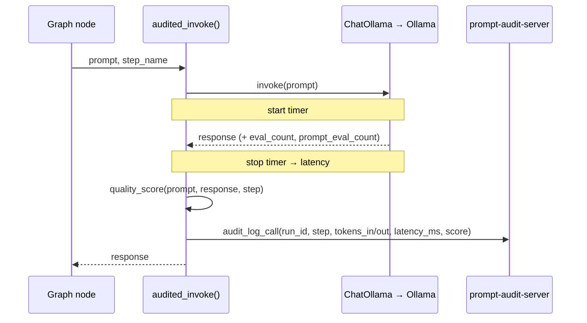
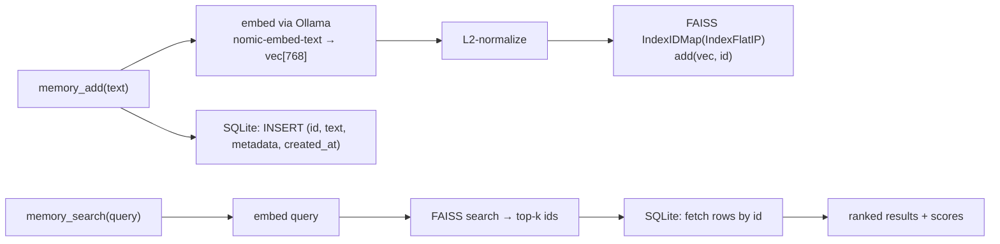

# Architecture

This document explains *how* `agent-mesh` is put together and *why* the key decisions were made. It is the reference for anyone extending the mesh or reviewing the design.

---

## 1. System topology

`agent-mesh` is a small distributed system: four processes that communicate over two protocols.



| Process | Role | Protocol exposed | Talks to |
|---|---|---|---|
| `orchestrator` | LangGraph agent; the demo client | — (it is a client) | all 3 servers + Ollama |
| `memory-server` | Vector memory | MCP over Streamable HTTP | Ollama (embeddings) |
| `file-bridge-server` | Document conversion | MCP over Streamable HTTP | — |
| `prompt-audit-server` | LLM call logging + stats | MCP over Streamable HTTP | — |
| `Ollama` (host) | LLM + embedding inference | HTTP REST | — |

Each server is independent and stateless at the protocol layer (state lives in its own SQLite/FAISS files on a mounted volume). Any MCP client can use any server in isolation; the orchestrator is simply the reference consumer that uses all three.

---

## 2. Why MCP, and why Streamable HTTP

### Why MCP at all

The point of the project is to expose capabilities as **reusable, discoverable services** rather than functions baked into one script. MCP gives us a vendor-neutral contract: a server declares its tools (name, input schema, annotations), and any compliant host — Claude Desktop, Cursor, an IDE, or our own LangGraph agent — can discover and invoke them without bespoke glue. Standing each capability up once and reusing it everywhere is the entire value proposition of a "mesh."

### Why Streamable HTTP (not stdio)

MCP defines two standard transports:

| Transport | How it works | Best for |
|---|---|---|
| **stdio** | Client launches the server as a subprocess; JSON-RPC over stdin/stdout | Local, single-client, desktop integrations |
| **Streamable HTTP** | Server is an independent process with one HTTP endpoint (`/mcp`) handling POST + optional SSE | Remote/networked, multi-client, containerized |

> Note: the older HTTP+SSE transport is **deprecated** in favor of Streamable HTTP. We do not use SSE.

Because the requirement is **separate containers brought up by `docker compose`**, the servers must be reachable over the network — stdio (subprocess-per-client) does not fit a multi-container topology. So all three servers run `mcp.run(transport="streamable-http")` and the orchestrator connects by URL.

We still support **stdio as a dev convenience** (a `--stdio` flag) so a single server can be driven directly by the MCP Inspector or Claude Desktop during development, with no Docker.

#### Stateless HTTP

The servers run with `stateless_http=True, json_response=True`. This matters because:
- `langchain-mcp-adapters`' `MultiServerMCPClient` is **stateless by default** — each tool call opens a fresh MCP `ClientSession`, runs the tool, and tears it down. A stateless server avoids "session not found" errors and scales to multiple replicas without session affinity.
- Our tools are individually atomic (add a memory, convert a file, log a call); we don't need long-lived server→client streaming for the demo.

---

## 3. Why Ollama runs on the host (not in a container)

The model location given (`D:\.ollama\models`) and the hardware (RTX 2070 Max-Q) point to **native Windows Ollama**. We keep it there on purpose:
- **GPU access is native.** Passing an NVIDIA GPU into Docker on Windows requires the NVIDIA Container Toolkit through WSL2 and is fiddly. Running Ollama on the host gives the model the full GPU with zero passthrough config.
- **Model cache is reused.** The 3.4 GB model already on disk at `D:\.ollama\models` is used as-is; no re-download into a container volume.
- **Containers reach it simply.** Docker Desktop exposes the host as `host.docker.internal`. Containers call `http://host.docker.internal:11434`. (On Linux we add `extra_hosts: ["host.docker.internal:host-gateway"]` so the same name resolves.)

The one requirement: Ollama must bind beyond loopback so containers can connect. Set `OLLAMA_HOST=0.0.0.0:11434` on the host. See [`SETUP.md`](SETUP.md).



---

## 4. Orchestration: deterministic graph vs. autonomous agent

This is the most important *application-level* decision, and it is driven by the model size.

`llama3.2:latest` supports native tool-calling, but a 4B model is **not** a reliable autonomous planner for a multi-step, multi-server workflow. Letting it freely decide which of a dozen tools to call, in what order, invites loops, skipped steps, and malformed tool arguments.

So the **primary** orchestrator is a **deterministic `StateGraph`**: the *pipeline shape* is fixed in code, and the LLM is used only for the genuinely generative steps.



| Node | Does | Uses LLM? | MCP tool |
|---|---|---|---|
| `ingest` | Read input path, basic validation | no | — |
| `convert` | Normalize to clean text | no | `filebridge_convert_file` |
| `extract` | Pull key points (structured) | **yes** | — (then `memory_add`) |
| `store` | Persist key points as memories | no | `memory_add` |
| `summarize` | Produce final summary | **yes** | — |
| `report` | Assemble cost + quality report | no | `audit_get_stats` |

Benefits: predictable token usage, easy to test node-by-node, graceful degradation (a failed convert short-circuits cleanly), and the small model is only ever asked to do one bounded thing at a time.

**Secondary (optional/experimental):** a `create_react_agent(ChatOllama(...), tools)` variant that loads *all* MCP tools and lets the model drive. Useful to demonstrate the autonomous pattern and to stress-test the model's tool-calling — but it is explicitly the "advanced" path, not the default.

The two share the same MCP client and the same audit wrapper, so swapping is a one-line change.

### State shape (LangGraph)

```python
class PipelineState(TypedDict):
    input_path: str
    raw_text: str
    key_points: list[str]
    memory_ids: list[int]
    summary: str
    audit_run_id: str          # correlates all LLM calls in this run
    report: dict
    errors: list[str]
```

---

## 5. The audit wrapper (governance woven through the graph)

Every LLM invocation in the orchestrator goes through one wrapper instead of calling `ChatOllama` directly:



What gets captured per call:
- **Token counts** come straight from Ollama's response metadata (`prompt_eval_count` = input tokens, `eval_count` = output tokens), surfaced by `langchain-ollama` in `response.usage_metadata` / `response.response_metadata`. These are *real* counts, not estimates.
- **Latency** is wall-clock around the invoke.
- **Quality score** — see §6.
- **run_id** ties all calls from one pipeline execution together so `audit_get_stats(run_id=...)` produces a per-run cost report.

This is the concrete expression of the "prompt governance" idea: nothing the model does is unmeasured.

---

## 6. Quality score & anomaly detection (defined, not hand-wavy)

"Quality score" is deliberately specified so it is reproducible.

**v1 — deterministic heuristic, range `[0.0, 1.0]`** (default; no extra model calls):
A weighted blend of cheap, objective signals:

| Signal | Weight | Meaning |
|---|---|---|
| `non_empty` | 0.30 | Response is non-empty and not a refusal/error string |
| `length_in_band` | 0.25 | Output length within the expected band for the step (e.g. extraction shouldn't return 5k tokens) |
| `format_valid` | 0.30 | For structured steps, output parses as the expected shape (e.g. valid JSON list of key points) |
| `latency_ok` | 0.15 | Latency-per-output-token under a configurable threshold |

The scorer is a pluggable function `score(prompt, response, step, meta) -> float`, so it can be swapped without touching the servers.

**v2 — LLM-as-judge (optional):** the same local model scores the response against a short rubric. More expensive (an extra call) and itself audited. Off by default; enabled via config.

**Anomaly detection (`audit_flag_anomaly`):** for a chosen metric (`latency_ms` or `total_tokens`), compute the rolling mean and standard deviation over the recent history and flag any record whose **z-score** exceeds a configurable `k` (default 3.0). This surfaces a call that suddenly took 5× longer or burned 4× the tokens — exactly the kind of regression prompt governance is meant to catch.

---

## 7. Cost model

Local inference is effectively $0 in cash, so the cost report is framed to be *useful*:
- **Local cost:** reported as compute time (seconds of GPU/CPU) — the real resource spent.
- **Notional cloud cost:** `(tokens_in × in_rate + tokens_out × out_rate)` using a configurable price table in `.env` (e.g. a GPT-4-class rate). This answers the question a portfolio reviewer actually cares about: *"what would this pipeline have cost on a hosted API?"*

Both numbers come out of `audit_get_stats`. The price table lives in config so it is never hard-coded.

---

## 8. Memory server internals



Design choices:
- **SQLite is the source of truth.** Text and metadata always live there; the FAISS index is a derived structure that can be **rebuilt from SQLite** if it is ever lost or corrupted.
- **`IndexIDMap` over `IndexFlatIP`** maps FAISS vectors to SQLite primary keys, and inner-product on L2-normalized vectors equals cosine similarity. Flat index is exact and more than fast enough for laptop-scale corpora; swap to `IndexHNSWFlat` later if the corpus grows.
- **Deletes** remove from SQLite and from the FAISS `IndexIDMap` by id (no full rebuild needed for single deletes).
- **Persistence:** the index is written to disk on change and the DB path + index path are configurable and volume-mounted.
- **Embeddings via Ollama** keep everything local and avoid pulling in `torch`/`sentence-transformers`. An offline fallback to `sentence-transformers/all-MiniLM-L6-v2` (384-dim) is available via config; the embedding dimension is read from config so the index matches the model.

---

## 9. File-bridge server internals & the adla-badli seam

The server is a thin, well-validated MCP wrapper around a **`Converter` protocol**:

```python
class Converter(Protocol):
    name: str
    def supported(self) -> list[tuple[str, str]]:   # [(from_fmt, to_fmt), ...]
        ...
    def convert(self, data: bytes, from_fmt: str, to_fmt: str) -> bytes:
        ...
```

- The public repo ships **reference converters** built on public tools:
  - **`markdown_native`** — pure-Python regex converter for `markdown→text`. No external binary needed; ships first in the registry so it takes the `(markdown, text)` pair without pandoc.
  - **`pandoc`** — via `pypandoc` for `docx`, `html`, `rst` conversions that require the full pandoc binary.
  - **`pdf`** — PyMuPDF for `pdf→text`.
  - **`passthrough`** — identity converter for `txt→text` and `markdown→markdown`.

  This means the demo runs out-of-the-box for `.md` and `.txt` inputs even without pandoc installed. Pandoc is only required for `.docx`/`.html`/`.rst` inputs.
- A private project (e.g. *adla-badli*) implementing the same `Converter` protocol can be **dropped into `servers/converters/` and registered** with no change to the MCP surface. The tool schema (`filebridge_convert_file`, etc.) stays identical; only the engine behind it changes.
- `filebridge_list_formats` reflects whatever converters are registered, so the advertised format matrix is always accurate.

This is how `agent-mesh` showcases conversion capability publicly while keeping any proprietary engine private.

---

## 10. Failure modes & resilience

| Failure | Behavior |
|---|---|
| A server is down at startup | Compose `healthcheck` + `depends_on: condition: service_healthy` holds the orchestrator until servers are ready |
| Ollama unreachable | Orchestrator fails fast with a clear message pointing at `OLLAMA_HOST`; servers that don't need the LLM still run |
| Conversion of an unsupported format | `filebridge_convert_file` returns a structured, actionable error listing supported formats — pipeline records the error and stops gracefully |
| FAISS index missing/corrupt | `memory-server` rebuilds it from SQLite on startup |
| Model returns malformed structured output | `format_valid` drops the quality score; the `extract` node retries once with a stricter prompt, then degrades to storing raw text |
| Tool call timeout | Per-tool timeout via the MCP adapter; surfaced as a recorded error, not a crash |

All tool errors are returned **inside the result** (with `isError`/actionable text), not as protocol-level exceptions, per MCP best practice — so the agent can read and react to them.

---

## 11. Security notes

Even for a local demo, the design follows MCP security guidance:
- **Input validation** on every tool via Pydantic models (types, ranges, lengths). File paths are sanitized to prevent directory traversal; the file-bridge server only reads from an allow-listed input directory.
- **No secrets in code.** Ollama URL, model names, DB paths, and price tables come from environment/`.env`.
- **Network exposure.** Inside the private compose network, servers bind `0.0.0.0` so peers can reach them. Their ports are **not** published to the host by default (only the orchestrator needs them); publish a port only when you want to attach the MCP Inspector. If you ever expose a server on a host interface directly, enable Origin-header validation / DNS-rebinding protection and bind to `127.0.0.1`.
- **Annotations** (`readOnlyHint`, `destructiveHint`, etc.) are advertised per tool to inform clients, with the explicit understanding that annotations are hints, not security boundaries.

---

## 12. What this architecture deliberately does *not* do (yet)

Kept out of scope to stay small and runnable; candidates for later (see `MILESTONES.md`):
- OAuth 2.1 / auth on the HTTP endpoints (fine for localhost; required before any real remote deployment).
- Horizontal scaling / a second replica per server (the stateless design already allows it).
- A persistent vector DB beyond FAISS+SQLite (e.g. Qdrant) — only needed at larger scale.
- Streaming responses to the client.
