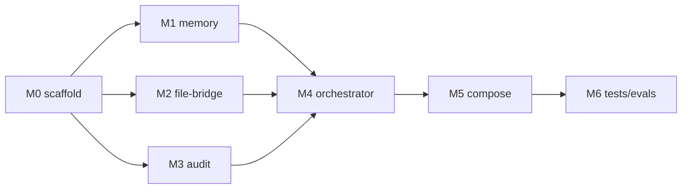

# Implementation Plan

A phase-by-phase build guide with concrete skeletons. Phases map to the milestones in [`MILESTONES.md`](MILESTONES.md). Build order respects dependencies: shared helpers → servers → orchestrator → compose → tests/evals.

> Skeletons are illustrative scaffolding (not full implementations) to lock interfaces and conventions. Each server's *core logic* is intended to stay within the LOC budgets in `REQUIREMENTS.md` (NFR-MAINT-1).

---

## Phase 0 — Scaffold & shared helpers (M0)

### 0.1 Layout

Create the tree from the README. The pieces that prevent duplication later are in `common/`.

### 0.2 `common/config.py`

Single source for environment config; loaded once per process.

```python
import os
from functools import lru_cache
from pydantic import BaseModel

class Settings(BaseModel):
    ollama_url: str = os.getenv("OLLAMA_URL", "http://host.docker.internal:11434")
    chat_model: str = os.getenv("CHAT_MODEL", "qwen3.5:4b")
    embed_model: str = os.getenv("EMBED_MODEL", "nomic-embed-text")
    embed_dim: int = int(os.getenv("EMBED_DIM", "768"))
    memory_db: str = os.getenv("MEMORY_DB", "/data/memory.sqlite")
    memory_index: str = os.getenv("MEMORY_INDEX", "/data/memory.faiss")
    audit_db: str = os.getenv("AUDIT_DB", "/data/audit.sqlite")
    files_dir: str = os.getenv("FILES_DIR", "/data/files")
    price_in_per_1m: float = float(os.getenv("PRICE_IN_PER_1M", "10.0"))
    price_out_per_1m: float = float(os.getenv("PRICE_OUT_PER_1M", "30.0"))
    price_currency: str = os.getenv("PRICE_CURRENCY", "USD")

@lru_cache
def settings() -> Settings:
    return Settings()
```

### 0.3 `common/responses.py`

Shared `markdown`/`json` formatting + pagination so no tool reimplements it.

```python
import json
from enum import Enum

class ResponseFormat(str, Enum):
    MARKDOWN = "markdown"
    JSON = "json"

def paginate(items, total, offset):
    count = len(items)
    has_more = total > offset + count
    return {"total": total, "count": count, "offset": offset, "items": items,
            "has_more": has_more, "next_offset": (offset + count) if has_more else None}

def render(payload: dict, fmt: ResponseFormat, to_markdown) -> str:
    return json.dumps(payload, indent=2, default=str) if fmt == ResponseFormat.JSON else to_markdown(payload)
```

### 0.4 `common/errors.py`

Consistent, actionable error envelopes (returned in-result, never raised to the protocol).

```python
import json

def tool_error(message: str, **extra) -> str:
    return json.dumps({"isError": True, "error": message, **extra}, indent=2)
```

**Exit:** `common/` importable; `python -c "import common.config"` works.

---

## Phase 1 — `memory-server` (M1)

Backend: FAISS `IndexIDMap(IndexFlatIP)` + SQLite. Embeddings via Ollama.

### 1.1 Storage helpers (`servers/memory_store.py`)

- `init_db()` / `init_index()` — create SQLite table and load-or-create FAISS index; **rebuild index from SQLite if missing** (FR-MEM-5).
- `embed(text) -> np.ndarray` — POST `/api/embeddings` to Ollama; L2-normalize.
- `add(text, metadata, tags) -> id`, `search(query, limit, min_score) -> rows`, `list(limit, offset)`, `delete(id)`.

```python
import sqlite3, json, numpy as np, faiss, httpx
from common.config import settings

def embed(text: str) -> np.ndarray:
    s = settings()
    r = httpx.post(f"{s.ollama_url}/api/embeddings",
                   json={"model": s.embed_model, "prompt": text}, timeout=30)
    r.raise_for_status()
    v = np.array(r.json()["embedding"], dtype="float32")
    return v / (np.linalg.norm(v) + 1e-12)            # cosine via inner product

def _new_index(dim: int) -> faiss.IndexIDMap:
    return faiss.IndexIDMap(faiss.IndexFlatIP(dim))
```

### 1.2 Server (`servers/memory_server.py`)

Wire the four tools with Pydantic inputs + annotations, delegating to the store. Skeleton for one tool:

```python
from mcp.server.fastmcp import FastMCP
from pydantic import BaseModel, Field, ConfigDict
from common.responses import ResponseFormat, paginate, render
from common.errors import tool_error
import memory_store as store

mcp = FastMCP("memory_mcp", stateless_http=True, json_response=True)

class MemoryAddInput(BaseModel):
    model_config = ConfigDict(str_strip_whitespace=True, extra="forbid")
    text: str = Field(..., min_length=1, max_length=20000,
                      description="Content to remember")
    metadata: dict | None = Field(default=None, description="Arbitrary JSON metadata")
    tags: list[str] | None = Field(default=None, max_length=20, description="Optional tags")

@mcp.tool(name="memory_add",
          annotations={"title": "Add memory", "readOnlyHint": False,
                       "destructiveHint": False, "idempotentHint": False,
                       "openWorldHint": False})
async def memory_add(params: MemoryAddInput) -> str:
    """Embed and persist a memory; returns its id and creation time."""
    try:
        rec = store.add(params.text, params.metadata or {}, params.tags or [])
        return render(rec, ResponseFormat.JSON, lambda p: f"Stored memory #{p['id']}.")
    except httpx.HTTPError:
        return tool_error(f"Embedding model '{settings().embed_model}' unreachable; check OLLAMA_URL.")
```

### 1.3 Entrypoint (stdio vs http)

```python
if __name__ == "__main__":
    import sys
    store.init_db(); store.init_index()
    if "--stdio" in sys.argv:
        mcp.run()                                   # local dev / Inspector
    else:
        mcp.run(transport="streamable_http", host="0.0.0.0", port=8001)
```

**Exit:** all four tools callable via Inspector; persistence + index-rebuild verified (FR-MEM-5/7).

---

## Phase 2 — `file-bridge-server` (M2)

### 2.1 `Converter` protocol + registry (`servers/converters/__init__.py`)

```python
from typing import Protocol

class Converter(Protocol):
    name: str
    def supported(self) -> list[tuple[str, str]]: ...
    def convert(self, data: bytes, from_fmt: str, to_fmt: str) -> bytes: ...

REGISTRY: list[Converter] = []
def register(c: Converter): REGISTRY.append(c)
def all_pairs() -> list[tuple[str, str]]:
    return sorted({p for c in REGISTRY for p in c.supported()})
def find(from_fmt: str, to_fmt: str) -> Converter | None:
    return next((c for c in REGISTRY if (from_fmt, to_fmt) in c.supported()), None)
```

### 2.2 Reference converters

- `pandoc_converter.py` — `pypandoc.convert_text(...)` for markdown/html/docx/rst pairs.
- `pdf_converter.py` — PyMuPDF (`fitz`) PDF→text.
- `passthrough_converter.py` — txt→text/markdown identity.

Register all three at import. Drop-in point for a private engine: add a module here, call `register(...)`.

### 2.3 Server (`servers/file_bridge_server.py`)

Tools `filebridge_convert_file` / `filebridge_list_formats` / `filebridge_preview_output`. Path sanitization for `source_path`:

```python
from pathlib import Path
from common.config import settings

def _safe_path(p: str) -> Path:
    root = Path(settings().files_dir).resolve()
    full = (root / p).resolve()
    if not str(full).startswith(str(root)):
        raise ValueError("path escapes allowed directory")
    return full
```

Unsupported pair → `tool_error(..., supported=all_pairs(), suggestion="call filebridge_list_formats")` (FR-FILE-5).

**Exit:** sample `.md`/`.pdf`/`.txt` convert; `list_formats` reflects registry; traversal blocked.

---

## Phase 3 — `prompt-audit-server` (M3)

### 3.1 Store (`servers/audit_store.py`)

- `init_db()` — `calls` table per `SERVER_SPECS.md`.
- `log(record) -> id`.
- `stats(run_id, since) -> dict` — aggregates + cost from the configured price table.
- `anomalies(metric, k, run_id, window) -> list` — z-score outliers.

```python
import statistics

def cost_block(tokens_in, tokens_out, compute_seconds):
    s = settings()
    cloud = tokens_in/1e6*s.price_in_per_1m + tokens_out/1e6*s.price_out_per_1m
    return {"local": {"compute_seconds": round(compute_seconds, 2), "currency_cost": 0.0},
            "notional_cloud": {"in_rate_per_1m": s.price_in_per_1m,
                              "out_rate_per_1m": s.price_out_per_1m,
                              "currency": s.price_currency, "cost": round(cloud, 4)}}

def z_anomalies(values, k):           # values: list[(id, x, meta)]
    xs = [v[1] for v in values]
    if len(xs) < 2: return []
    m, sd = statistics.mean(xs), statistics.pstdev(xs) or 1e-9
    return [{"id": i, "value": x, "z": round((x-m)/sd, 2), **meta}
            for (i, x, meta) in values if abs((x-m)/sd) >= k]
```

### 3.2 Server (`servers/prompt_audit_server.py`)

Three tools per spec. `audit_log_call` is the only non-read tool.

**Exit:** logging round-trips; `get_stats` cost matches the price table; injected slow call is flagged by `flag_anomaly`.

---

## Phase 4 — Orchestrator (M4)

### 4.1 MCP client + model (`agent/clients.py`)

```python
from langchain_mcp_adapters.client import MultiServerMCPClient
from langchain_ollama import ChatOllama
from common.config import settings

def make_client() -> MultiServerMCPClient:
    s = settings()
    base = lambda h, p: {"url": f"http://{h}:{p}/mcp", "transport": "streamable_http"}
    return MultiServerMCPClient({
        "memory":     base("memory-server", 8001),
        "filebridge": base("file-bridge-server", 8002),
        "audit":      base("prompt-audit-server", 8003),
    })

def make_llm() -> ChatOllama:
    s = settings()
    return ChatOllama(model=s.chat_model, base_url=s.ollama_url, temperature=0.2)
```

### 4.2 Audit wrapper (`agent/audited.py`)

Every LLM call goes through here (FR-ORCH-4). Real token counts come from `usage_metadata`.

```python
import time, uuid
from agent.quality import score

async def audited_invoke(llm, tools_by_name, run_id, step, messages, expect="text"):
    t0 = time.perf_counter()
    resp = await llm.ainvoke(messages)
    latency_ms = int((time.perf_counter() - t0) * 1000)
    um = getattr(resp, "usage_metadata", None) or {}
    tin, tout = um.get("input_tokens", 0), um.get("output_tokens", 0)
    q = score(messages, resp, step, expect)
    await tools_by_name["audit_log_call"].ainvoke({
        "run_id": run_id, "step": step, "model": llm.model,
        "tokens_in": tin, "tokens_out": tout,
        "latency_ms": latency_ms, "quality_score": q})
    return resp
```

### 4.3 Quality scorer (`agent/quality.py`)

Implements the v1 heuristic from `ARCHITECTURE.md` §6; pluggable. Optional v2 LLM-judge behind a flag.

### 4.4 Deterministic graph (`agent/orchestrator.py`)

```python
from langgraph.graph import StateGraph, START, END
from typing import TypedDict

class PipelineState(TypedDict, total=False):
    input_path: str; raw_text: str; key_points: list[str]
    memory_ids: list[int]; summary: str; run_id: str; report: dict; errors: list[str]

async def build_graph(llm, tools):
    by = {t.name: t for t in tools}
    g = StateGraph(PipelineState)

    async def ingest(s):    ...   # read & validate input path
    async def convert(s):         # filebridge_convert_file → raw_text
        res = await by["filebridge_convert_file"].ainvoke(
            {"source_path": s["input_path"], "to_format": "text"})
        return {"raw_text": parse_text(res)}
    async def extract(s):         # audited LLM → key_points (structured)
        r = await audited_invoke(llm, by, s["run_id"], "extract", extract_prompt(s["raw_text"]), expect="json")
        return {"key_points": parse_points(r)}
    async def store(s):           # memory_add per point
        ids = [parse_id(await by["memory_add"].ainvoke({"text": p})) for p in s["key_points"]]
        return {"memory_ids": ids}
    async def summarize(s):
        r = await audited_invoke(llm, by, s["run_id"], "summarize", summary_prompt(s["raw_text"]))
        return {"summary": r.content}
    async def report(s):
        rep = await by["audit_get_stats"].ainvoke({"run_id": s["run_id"], "response_format": "json"})
        return {"report": parse_json(rep)}

    for name, fn in [("ingest", ingest), ("convert", convert), ("extract", extract),
                     ("store", store), ("summarize", summarize), ("report", report)]:
        g.add_node(name, fn)
    g.add_edge(START, "ingest"); g.add_edge("ingest", "convert")
    g.add_edge("convert", "extract"); g.add_edge("extract", "store")
    g.add_edge("store", "summarize"); g.add_edge("summarize", "report")
    g.add_edge("report", END)
    return g.compile()
```

### 4.5 Optional ReAct variant

```python
from langgraph.prebuilt import create_react_agent
agent = create_react_agent(llm, tools)   # selected by --react; same tools, model drives
```

### 4.6 CLI (`python -m agent.orchestrator`)

```python
import argparse, asyncio, uuid

async def main():
    ap = argparse.ArgumentParser()
    ap.add_argument("--input", default="examples/sample.md")
    ap.add_argument("--react", action="store_true")
    a = ap.parse_args()
    async with make_client() as client:            # stateless; fresh sessions per call
        tools = await client.get_tools()
        llm = make_llm()
        run_id = f"run-{uuid.uuid4().hex[:8]}"
        if a.react:
            out = await create_react_agent(llm, tools).ainvoke(
                {"messages": f"Process {a.input}: convert, extract key points to memory, summarize, report cost."})
            print(out["messages"][-1].content)
        else:
            graph = await build_graph(llm, tools)
            final = await graph.ainvoke({"input_path": a.input, "run_id": run_id, "errors": []})
            print_report(final)                      # summary + cost/quality report
```

**Exit:** one-command run produces summary + cost report; `--react` runs the autonomous path.

---

## Phase 5 — Docker Compose mesh (M5)

### 5.1 Per-service Dockerfiles

Each server gets a slim image installing only its deps (TECH_STACK dependency map). Sketch (`servers/Dockerfile.memory`):

```dockerfile
FROM python:3.12-slim
WORKDIR /app
COPY requirements/memory.txt .
RUN pip install --no-cache-dir -r memory.txt
COPY common/ ./common/
COPY servers/memory_server.py servers/memory_store.py ./servers/
ENV PYTHONPATH=/app
CMD ["python", "servers/memory_server.py"]
```

The file-bridge image additionally `apt-get install -y pandoc`. The orchestrator image installs the LangChain stack and runs the CLI.

### 5.2 `docker-compose.yml`

```yaml
name: agent-mesh
services:
  memory-server:
    build: { context: ., dockerfile: servers/Dockerfile.memory }
    environment: [ "OLLAMA_URL=http://host.docker.internal:11434", "EMBED_MODEL=nomic-embed-text", "EMBED_DIM=768" ]
    volumes: [ "memdata:/data" ]
    extra_hosts: [ "host.docker.internal:host-gateway" ]
    healthcheck:
      test: ["CMD", "python", "-c", "import socket,sys; s=socket.create_connection(('localhost',8001),3); sys.exit(0)"]
      interval: 5s
      timeout: 3s
      retries: 5

  file-bridge-server:
    build: { context: ., dockerfile: servers/Dockerfile.filebridge }
    volumes: [ "filedata:/data" ]
    healthcheck:
      test: ["CMD", "python", "-c", "import socket,sys; s=socket.create_connection(('localhost',8002),3); sys.exit(0)"]
      interval: 5s
      timeout: 3s
      retries: 5

  prompt-audit-server:
    build: { context: ., dockerfile: servers/Dockerfile.audit }
    environment: [ "PRICE_IN_PER_1M=10.0", "PRICE_OUT_PER_1M=30.0", "PRICE_CURRENCY=USD" ]
    volumes: [ "auditdata:/data" ]
    healthcheck:
      test: ["CMD", "python", "-c", "import socket,sys; s=socket.create_connection(('localhost',8003),3); sys.exit(0)"]
      interval: 5s
      timeout: 3s
      retries: 5

  orchestrator:
    build: { context: ., dockerfile: agent/Dockerfile }
    environment: [ "OLLAMA_URL=http://host.docker.internal:11434", "CHAT_MODEL=qwen3.5:4b" ]
    extra_hosts: [ "host.docker.internal:host-gateway" ]
    volumes: [ "./examples:/app/examples:ro" ]
    depends_on:
      memory-server: { condition: service_healthy }
      file-bridge-server: { condition: service_healthy }
      prompt-audit-server: { condition: service_healthy }
    command: ["python", "-m", "agent.orchestrator", "--input", "examples/sample.md"]

volumes: { memdata: {}, filedata: {}, auditdata: {} }
```

Notes:
- Server ports are **not published** to the host (only the orchestrator needs them). To attach the MCP Inspector, temporarily add a `ports:` mapping for that server.
- `extra_hosts` makes `host.docker.internal` resolve on Linux too; on Windows/macOS Docker Desktop provides it natively.
- Healthchecks gate the orchestrator so it never races server startup (NFR-REL-3).

**Exit:** `docker compose up --build` → 3 healthy servers + orchestrator runs the demo end-to-end.

---

## Phase 6 — Tests, evals, polish (M6)

See [`TESTING_AND_EVALUATION.md`](TESTING_AND_EVALUATION.md). Summary:
- **Unit:** store functions (embed/add/search/delete; stats/anomaly math; converters) with the MCP in-memory transport.
- **Integration:** each server over Streamable HTTP; persistence + index rebuild; traversal blocked.
- **E2E:** the full pipeline against the sample; assert summary present, ≥1 memory stored, token counts match Ollama, cost computed.
- **Evals:** ≥10 read-only Q&A per server in `evals/` run by the harness.
- **Polish:** README badges, `requirements.lock`, lint (`ruff`), type-check (`mypy`), example outputs.

---

## Build sequence (at a glance)



The three servers (M1–M3) are independent and can be built in parallel after M0; the orchestrator (M4) needs all three.
